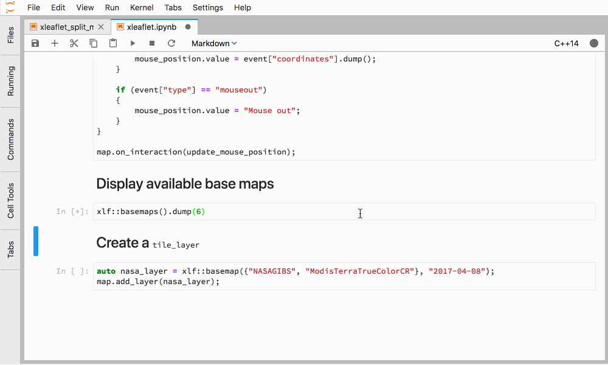
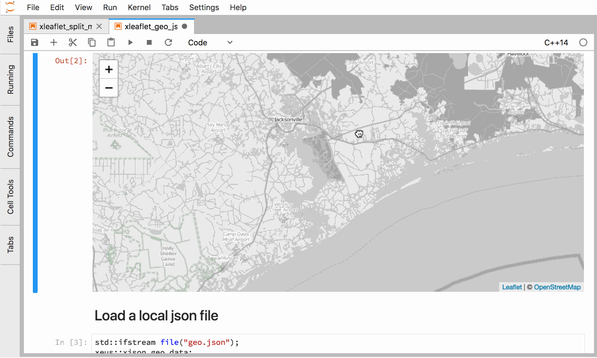
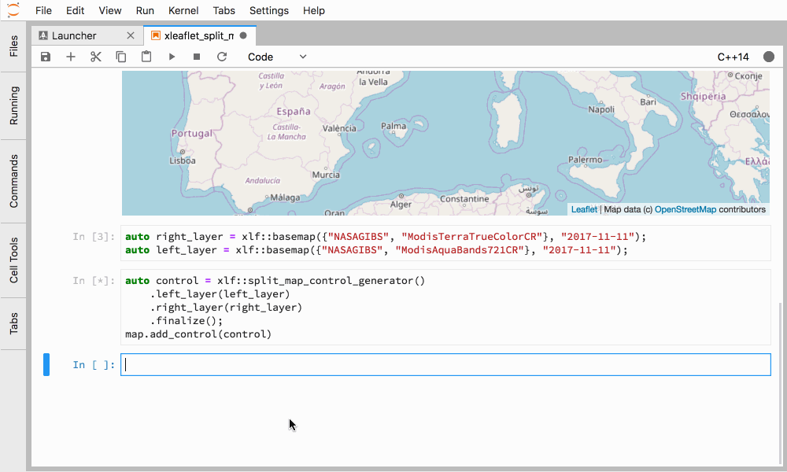
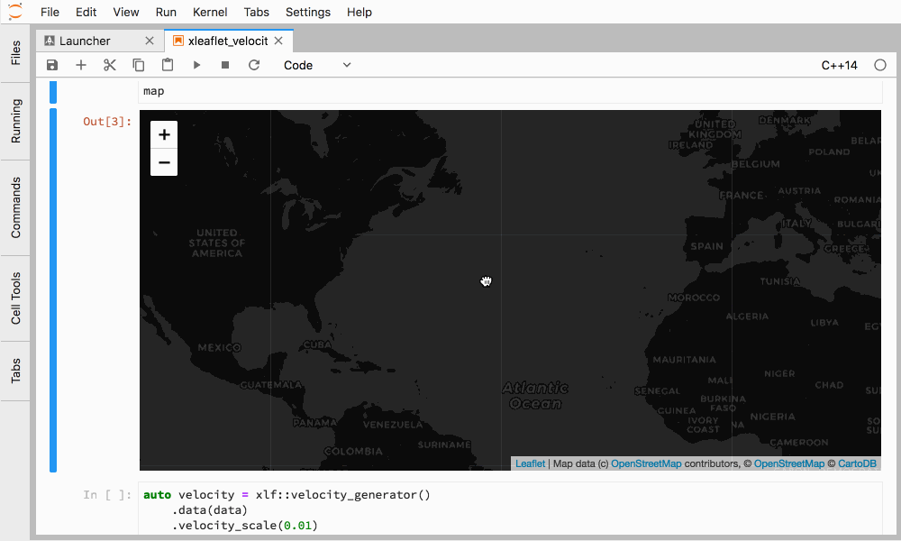

# 

[](https://travis-ci.org/QuantStack/xleaflet)
[](https://ci.appveyor.com/project/QuantStack/xleaflet)
[](https://xleaflet.readthedocs.io/en/latest/?badge=latest)
[](https://mybinder.org/v2/gh/QuantStack/xleaflet/0.2.0?filepath=notebooks)
[](https://gitter.im/QuantStack/Lobby?utm_source=badge&utm_medium=badge&utm_campaign=pr-badge&utm_content=badge)

C++ backend for the jupyter-leaflet map visualization library

## Usage

Selecting a base layer for a map:



Loading a geojson dataset:



Using the splitmap control:



Displaying velocity data on the top of a map:



## Installation

We provide a package for the conda package manager.

- Installing `xleaflet` and the C++ kernel

```bash
conda install xeus-cling xleaflet -c QuantStack -c conda-forge
```

Then, the front-end extension must be installed for either the classic notebook or JupyterLab.

- Installing the extensions for the classic notebook

```
conda install widgetsnbextension -c conda-forge
conda install ipyleaflet -c conda-forge
```

- Installing the JupyterLab extension

```
jupyter labextension install @jupyter-widgets/jupyterlab-manager
jupyter labextension install jupyter-leaflet
```

## Installation from sources

Or you can directly install it from the sources if you have all the dependencies already installed:

```bash
cmake -D CMAKE_INSTALL_PREFIX=your_install_prefix
make install
```

## Trying it online

To try out xleaflet interactively in your web browser, just click on the binder
link:

[](https://mybinder.org/v2/gh/QuantStack/xleaflet/0.2.0?filepath=notebooks/)

## Documentation

To get started with using `xleaflet`, check out the full documentation

http://xleaflet.readthedocs.io/

## Dependencies

All the dependencies of xleaflet are available for the conda package manager.

| `xleaflet` | `xwidgets`  |  `xeus`         |
|------------|-------------|-----------------|
|  master    |   ~0.12.0   |  >=0.13.0,<0.14 |
|  0.2.0     |   ~0.12.0   |  >=0.13.0,<0.14 |
|  0.1.0     |   ~0.10.0   |  >=0.12.0,<0.13 |
|  0.0.1     |   ~0.9.0    |  >=0.12.0,<0.13 |

## License

We use a shared copyright model that enables all contributors to maintain the
copyright on their contributions.

This software is licensed under the BSD-3-Clause license. See the [LICENSE](LICENSE) file for details.

